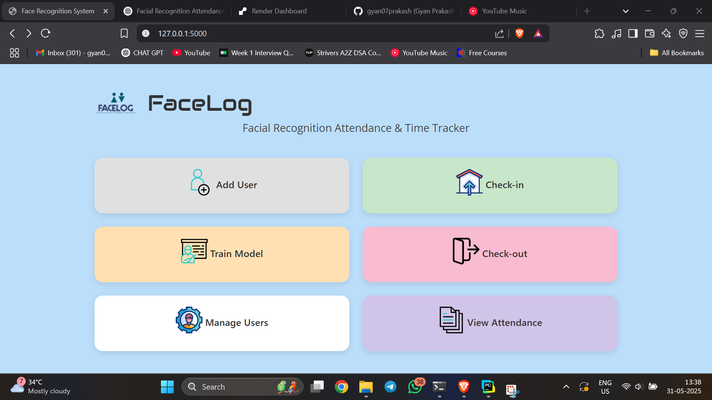
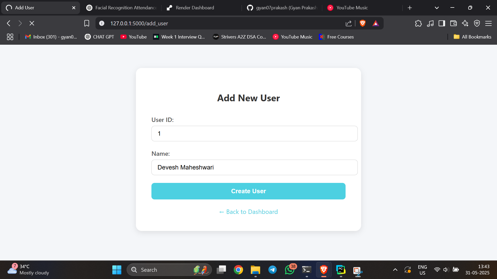
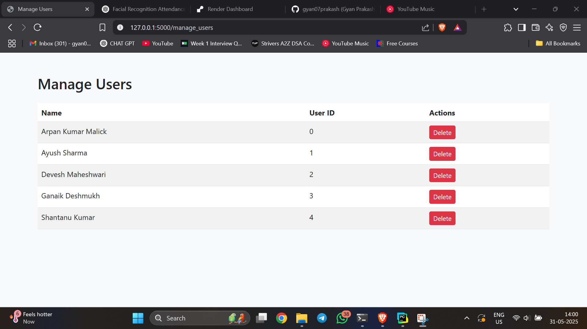
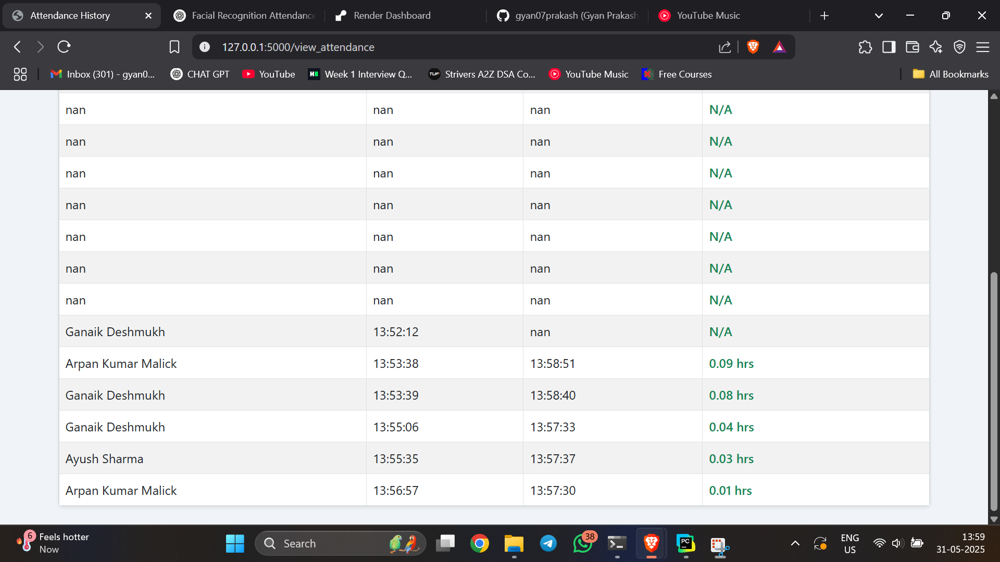

# FaceLog

**FaceLog** is a facial recognition-based attendance and time tracking system built with Flask and OpenCV.

## 🧠 Features

- Add and manage users with webcam photos
- Train facial recognition model (LBPH)
- Check-in / Check-out with face recognition
- View attendance history and timestamps
- Time tracking (total duration calculation)
- Responsive dashboard UI (Flask + Bootstrap)

## 📌 Tagline

> Facial Recognition Attendance & Time Tracker

## 📂 Project Structure
FaceLog/
├── app.py
├── requirements.txt
├── templates/
├── static/
├── trained_model/
├── face_data/
└── attendance.csv


## 🚀 Setup Instructions

### 1. Clone the Repository
```bash
git clone https://github.com/yourusername/facelog.git
cd facelog
```

### 2. Install Dependencies
```bash
pip install -r requirements.txt
```

### 3. Run the App
```bash
python app.py
```
Then open your browser and visit: http://localhost:5000


## 📸 Screenshots
### Dashboard


### Add User


### Manage User


### View Attendance



🙌 Contributing
Feel free to open issues or submit pull requests to improve this project.


